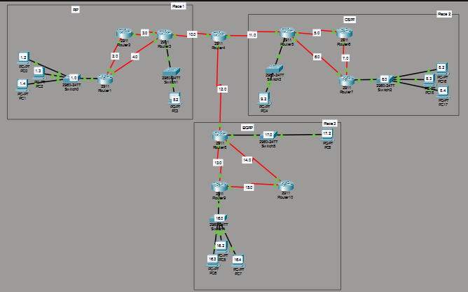
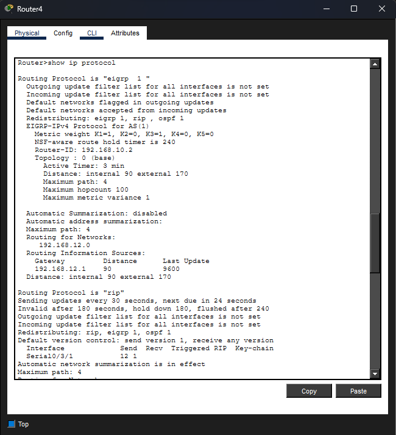
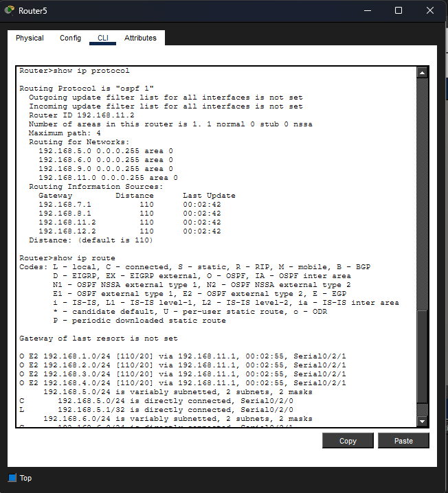
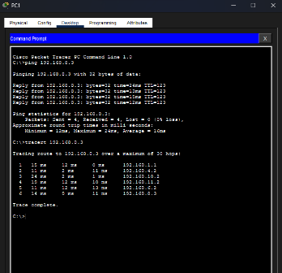

# Multi-Protocol Routing Simulation

A Cisco Packet Tracer project demonstrating **RIP, OSPF, EIGRP, and mutual route redistribution** across multiple routing domains.

## 📌 Project Overview

Built a multi-router network where **Router4 connects the RIP, OSPF, and EIGRP routing domains** and acts as the central **route redistribution router**.

Router4 was configured to exchange routes between the three routing protocols, allowing networks learned through one routing protocol to be advertised into the others.

## 🔧 What I Built

* Configured **RIP** routing.
* Configured **OSPF Process 1 in Area 0**.
* Configured **EIGRP AS 1**.
* Connected the **RIP, OSPF, and EIGRP** routing domains through **Router4**.
* Configured **mutual route redistribution** on Router4.
* Verified redistributed routes using routing tables.
* Verified **OSPF external routes (E2)**.
* Tested end-to-end connectivity using `ping`.

## 🌐 Network Topology



### Router4 Transit Networks

| Routing Protocol | Router4 Transit Network |
| ---------------- | ----------------------- |
| RIP              | `192.168.10.0/24`       |
| OSPF             | `192.168.11.0/24`       |
| EIGRP            | `192.168.12.0/24`       |

**Router4** is the central router connecting all three routing domains and performing route redistribution between **RIP, OSPF, and EIGRP**.

## 🔄 Routing Protocols

| Protocol       | Configuration      |
| -------------- | ------------------ |
| RIP            | RIP routing domain |
| OSPF           | Process 1, Area 0  |
| EIGRP          | AS 1               |
| Redistribution | RIP ↔ OSPF ↔ EIGRP |

### EIGRP

EIGRP is configured on the routing domain connected to Router4 through the `192.168.12.0/24` transit network.

### OSPF

OSPF Process 1 is configured in **Area 0** and connects to Router4 through the `192.168.11.0/24` transit network.

### RIP

RIP connects to Router4 through the `192.168.10.0/24` transit network.

## ⚙️ Implementation

1. Created the multi-router topology in Cisco Packet Tracer.
2. Configured IPv4 addresses on router interfaces and end devices.
3. Configured **RIP, OSPF, and EIGRP** on their respective routers.
4. Configured **Router4 for mutual route redistribution** between RIP, OSPF, and EIGRP.
5. Verified routing protocols and learned routes.
6. Verified OSPF external routes.
7. Tested end-to-end connectivity using `ping`.

### Key Verification Commands

show ip interface brief
show ip protocols
show ip route
ping <DESTINATION_IP>

## ✅ Verification

### Router4 — Routing Protocols & Redistribution

`show ip protocols` was used to verify **RIP, OSPF, EIGRP, and route redistribution** configured on Router4.



### OSPF — External Routes

RIP-originated networks were observed as **OSPF E2 external routes** in the OSPF routing domain.



### Connectivity Test

`ping` was used to verify communication between devices across different routing domains.



## 📚 What I Learned

* Configuring RIP, OSPF, and EIGRP.
* Configuring **mutual route redistribution**.
* Understanding how different routing protocols exchange routes.
* Reading and interpreting routing tables.
* Identifying OSPF external routes.
* Verifying routing protocols using Cisco IOS commands.
* Testing network connectivity using `ping`.

## 🛠️ Technologies & Skills

* Cisco Packet Tracer
* Cisco IOS
* Computer Networking
* IPv4
* RIP
* OSPF
* EIGRP
* Route Redistribution
* Routing Tables
* Network Troubleshooting

## 📁 Project Structure

```text
Multi-Protocol-Routing-Simulation/
├── EIGRP_RIP_OSPF.pkt
├── README.md
├── Topology.png
├── RIP_router.png
├── OSPF_router.png
├── EIGRP_router.png
├── Router-4.png
└── Ping.png
```
